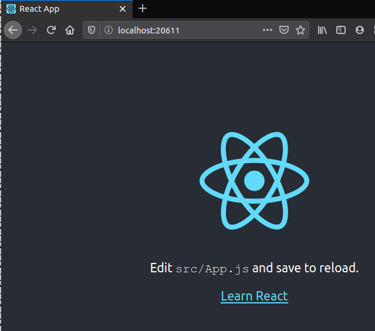

Work at localhost, read [here](./doc/run-localhost.md)
Work for production deploy, read [here](./doc/run-localhost.md)

# branch :dockerize note
build and run the container
```bash
 ./docker/localhost/build.sh
 ./docker/localhost/run.sh 
```

then we can access the web at
```
http://localhost:20611
```

we should see this webapp in the webbrowser
